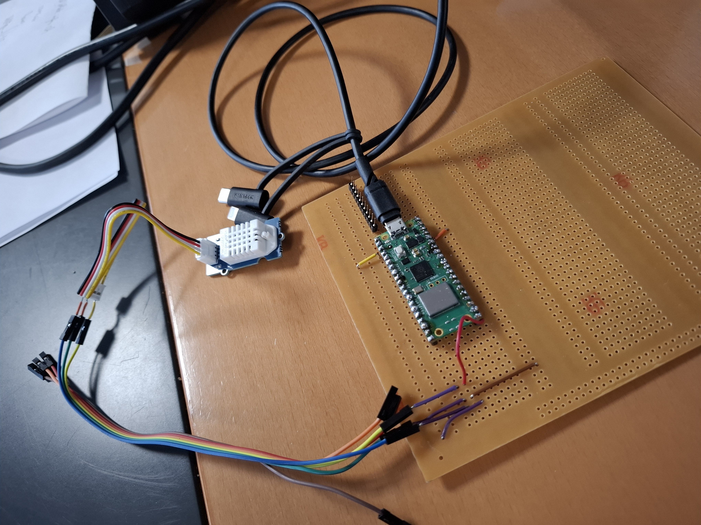

## **Projet :** TemperatureXhumidity Captors Pro with a Web Page
**Made by :** *Apllinaire-K* / Mathis.M\
**Coded into :** Micro-python\
**Material :**  \
1x BreadBoard\
1x Raspberry PICO W\
1x Micro-USB->USB-C\
1x PC with Thonny installed on it.\
1x Welding Kit\
1x Tin Coil\
1x A third Hand [Optional]\
1x Grove Temperature/Humidity Profesinal Captor\
3x Wire (Best to get more around 8-10 wires)\
2x Pin Header 1x20

This Project is the base to a prototype of captor wich have for objective to be conecte to 1 wifi and be able to display with ever one we want depending of it ip to manage easier and event collect the data.

**Image of the project :**  

## **Explication on how to realise this project :**
In this part i will explain you how to fully realised that project step by step the best as i can.
### <ins> **Step 1 :** </ins>
The first step is to prepare your Rasberry PICO W on the breadboard you are going to use with the two 1x20 Pin header (Note : Think about checking for the connection behind the breadboard as you don't want two pin to be on the same line and to be as so connected.)\
After you are sure you place all the pin correctly throught the board and the raspberry you can weld them all to be sure the card is stable and in case you need it later on. (Also pay attention of not welding two pin toghether).\
After that you are going to need to take your Grove captors and use you wire to either plug them on the good exit ping of the board or either to a other place on the breard board and then conecte them with a second wire the result will not change.\
For the placement follow that : GND --> GND, VCC --> 3.3v, SIG --> GPIO (wich ever one you want). After that when you are sure they are all correctly place witch ever way you chose to do it you weld it to the breadboard.\
### <ins> **Step 2 :** </ins>  
After that everything is done on the physical part now it time to prepare everything else,\
First you need to get you Wifi SSID and Password, in case you just to make a prototype and don't want to bother too much you can create a wifi hotspot with you're pc (If you don't know how here go check [that](https://support.microsoft.com/en-us/windows/use-your-windows-device-as-a-mobile-hotspot-c89b0fad-72d5-41e8-f7ea-406ad9036b85#:~:text=Select%20Start%20%2C%20then%20select%20Settings,network%20name%20and%20password%20%3E%20Save.) )\
Once you got them you will need to download "Thonny" (you can use an equivalent that will probably work but i will not guarentie anything) if you want it available over [here](https://thonny.org/).\
Once you got Thonny you will that it pretty easy to understand (and at worst there are hundred of tutorial online.). After that you will need to be able to do some micro-python into your raspberry PICO and for that you need to download the good micro python UF2 from the rasberry official site [here](https://www.raspberrypi.com/documentation/microcontrollers/micropython.html), the version we want in that case is the PICO W UF2 file.\
Once you have that file you are going to need to put it onto the raspberry PICO, if you don't allready know how to do it know that you only need to hold the reset button as you plug your raspberry to your PC when your raspberry is conna be pluged you will see in your drive a new one named "RP-RPI2", once you found it you juste have to slide the folder inside and it should be good to go.\
After that you would need to get library afilited from Seeed Studio (I reposted it into the githut to make it easier to find and dowload.) Once downloaded inside you need to get and open the first file and take DHT11, DHT20. to the *D.CmdM*
